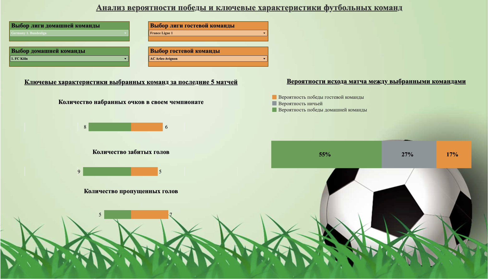

# football_prediction_dashboard
# Аналитика футбольных матчей: Дашборд для прогнозирования исходов

## Описание

Учебный проект: дашборд для анализа и прогнозирования исхода футбольных матчей для частного инвестора. Вся цепочка: SQL-джойны, аналитика на Python, визуализация в Tableau.

## Задача

- Построить дашборд для прогнозирования результатов матча между выбранными футбольными командами.
- Выделить ключевые характеристики, влияющие на результат игры.
- Убедить пользователя в эффективности аналитического пайплайна.

## Архитектура проекта

1. **SQL**
    - Джойны и подготовка данных из исходных таблиц (матчи, команды, игроки, котировки).
    - Получение итогового датасета: `data/запрос_ред_база.csv`.
2. **Python/Jupyter Notebook**
    - Аналитика, выявление ключевых признаков и метрик.
    - Подготовка данных для визуализации.
    - Основной ноутбук: `notebooks/CL-Project-Team-2.-PREFINAL.ipynb`.
3. **Tableau**
    - Итоговая визуализация для пользователя.
    - Скриншот: `dashboard/image.jpg`.

## Структура репозитория

```football_prediction_dashboard/
├─ data/
│    └─ запрос_ред_база.csv
├─ notebooks/
│    └─ CL-Project-Team-2.-PREFINAL.ipynb
├─ sql/
│    ├─ initial_join.sql
│    └─ final_query.sql
├─ dashboard/
│    ├─ tableau_dashboard.twb
│    └─ image.jpg
├─ README.md
├─ LICENSE
├─ .gitignore
└─ requirements.txt
```


## Ключевые метрики для прогноза

- Количество набранных очков за последние 5 матчей
- Количество забитых мячей
- Количество пропущенных мячей

## Как пользоваться проектом

- SQL: обработать исходные данные скриптами из папки `/sql`.
- Python: провести анализ, повторить обработку данных в ноутбуке `/notebooks`.
- Данные для визуализации — итоговый CSV: `/data/запрос_ред_база.csv`.
- Визуализация: открыть Tableau Dashboard (`dashboard/image.jpg` для примера).

## Пример дашборда



## Требования

- PostgreSQL для обработки исходных данных
- Python 3.8+ и библиотеки (см. `requirements.txt`)
- Tableau для визуализации

## Автор

- Имя, контакты, при необходимости


